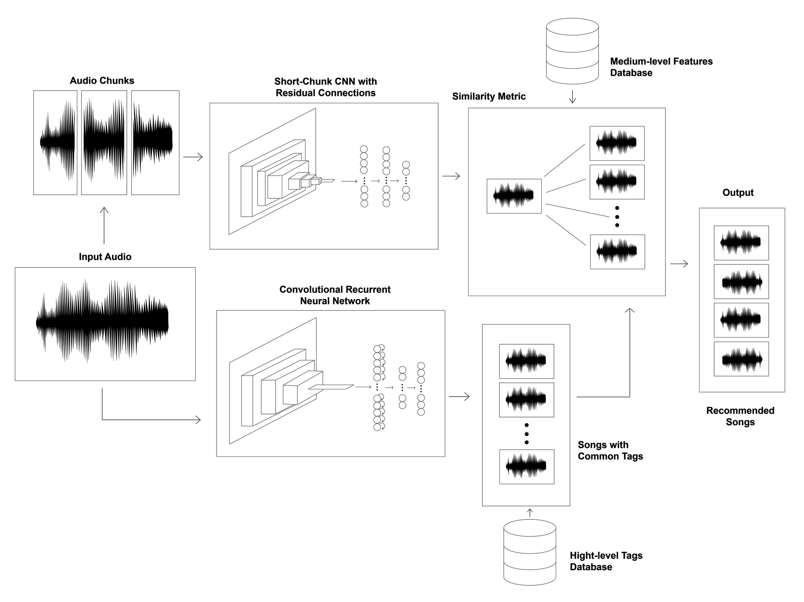

# Content-based Music Recommendations: A Deep Learning Approach

## General Description

<details>
  <summary><b>Motivation</b></summary>

  Major 

</details>

<details>
  <summary><b>Approach</b></summary>

  The
  

</details>

## How to reproduce the research project

**1)**: Clone the repository:

```sh
git clone https://github.com/PascualMeritaTorres/Deep-Learning-Music-Recommendation-System.git
```

**2)**: This project can be subdivided into 2 parts, namely data preprocessing which is done inside the Data-Creation-And-Preprocessing, and the training of the machine learning models, which is done inside the CRNN-Model and Short-ChunkCNNRes-Model folders.

Therefore, to facilitate package versions you must create 3 different environments, for executing commands inside each of the folders.

Create a conda environment and install all the required packages for the CRNN machine learning model:

    ```
    cd CRNN-Model
    conda env create -f environment.yml -n YOUR_ENV_NAME
    ```

Create a conda environment and install all the required packages for the Short-ChunkCNNRes machine learning model:

    ```
    cd Short-ChunkCNNRes-Model
    conda env create -f environment.yml -n YOUR_ENV_NAME
    ```

Create a pip virtual environment and install all the packages for data preprocessing:

    ```
    cd Dataset-Creation-And-Preprocessing
    pip install virtualenv
    virtualenv YOUR_ENV_NAME
    source YOUR_ENV_NAME/bin/activate
    pip install -r requirements.txt
    ```

**3)**: Retrieve spotify data, and preprocess data (For detailed instructions, see `README.md` file under the Dataset-Creation-And-Preprocessing folder)
**4)**: Choose one of the following options:

- Train the model (For detailed instructions, see the `README.md` file under the CRNN-Model and Short-ChunkCNNRes-Model folder)
- Receive music recommendations from an input song (For detailed instructions, see the `README.md` file under the MachineLearningModelScripts folder)

## Repo Structure

```
│
├── Dataset-Creation-And-Preprocessing    
│   ├── notebooks                         <- The necessary notebooks to extract and modify Spotify data
│   ├── our_data                          <- Where the dataset will be stored
│   └── README.md                         <- Detailed Instructions to prepare the Spotify data
│
│
├── CRNN-Model
│   ├── models                            <- Stores the pre-trained machine learning models
│   ├── preprocessing                     <- Scripts to preprocess data
│   ├── split                             <- Includes the data split used 
│   ├── test_songs                        <- Dummy-songs used for testing the models
│   ├── training                          <- Scripts to train the model
│   └── README.md                         <- Detailed instructions to train the model or receive music recommendations
│
├── Short-ChunkCNNRes-Model
│   ├── models                            <- Stores the pre-trained machine learning models
│   ├── preprocessing                     <- Scripts to preprocess data
│   ├── split                             <- Includes the data split used 
│   ├── test_songs                        <- Dummy-songs used for testing the models
│   ├── training                          <- Scripts to train the model
│   └── README.md                         <- Detailed instructions to train the model or receive music recommendations
│
├── Recommendations
│   ├── models                            <- Stores the pre-trained machine learning models
│   ├── preprocessing                     <- Scripts to preprocess data
│   ├── split                             <- Includes the data split used 
│   ├── test_songs                        <- Dummy-songs used for testing the models
│   ├── training                          <- Scripts to train the model
│   └── README.md                         <- Detailed instructions to train the model or receive music recommendations
|
├── README.md                             <- The document you are currently reading, written for developers to replicate 
|                                         the environment used in the research project
|
└── requirements.txt                      <- The packages that must be installed
```
