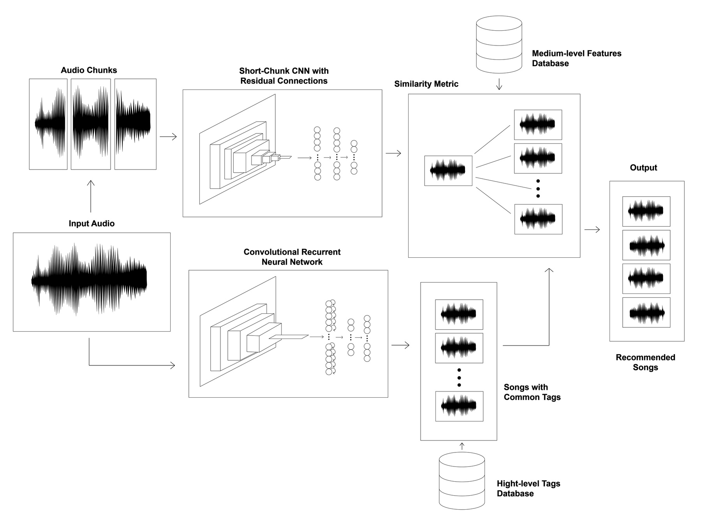

# Similarity-based Recommendations for DJs and Music Producers: A Deep Learning Approach

## General Description

<details>
<summary><b>💡 Motivation</b></summary>

Major music streaming platforms, such as Spotify and Apple Music, have implemented sophisticated systems to provide tailored song recommendations to their users. They believe attaining the best recommendations requires balancing certain trade-offs. For instance, they recommend a diverse selection of genres and styles while ensuring recommended songs are not too dissimilar to the input.  However, certain demographics, such as disc jockeys (DJs) and music producers, exhibit unique needs that diverge from those of the general public.

Firstly, they really prioritize similarity-based recommendations. This is because DJs seek songs that closely resemble the one they are currently playing, and similarly, music producers want similar tracks with the objective of drawing inspiration from them.

Secondly, DJs frequently play unreleased songs, and music producers require recommendations for unfinished works, which are still “in production”. Therefore, these songs are not in any database, like the one Spotify could have, and so their features are not known. As a result, their features need to be extracted. In other words, a recommendation system tailored to their needs must allow users to upload their songs in audio format, and the system must employ a method for feature extraction before recommending songs.

Thirdly, DJs and Music producers typically favour recommendations with shared high-level features (tags) like instruments and genres. This is because DJs find it is simpler to mix tracks from the same genre, and music producers feel more creatively inspired by listening to songs with similar instrumentation. However, recommending song with similar tags is simply not enough. Tracks from the same genre or with similar instruments can still display huge differences which may be crucial for DJs and music producers. To give a very simple example, two songs within the same genre may exhibit a drastic difference in tempo, with one being exceptionally fast and the other very slow. This poses a challenge for DJs as it may be very difficult to mix the two songs together. Additionally, music producers wont be able to draw as much inspiration from a very slow song if they want to produce a fast song, as different mixing and production techniques may be required for each of them. Consequently, mixing tags and medium-level features is crucial when developing a music recommendation system tailored to these demographics.

</details>

<details>
<summary><b>🔎 Approach</b></summary>

The primary objective of this research project is to develop a two-step approach to similarity-based music recommendations tailored for DJs and music producers, addressing the aforementioned requirements.

Firstly, upon receiving a user-inputted audio file, tags, such as instruments and genres, are extracted using a Convolutional Recurrent Neural Network , as seen in the bottom part of the figure below. Songs that lack these tags are excluded from the pool of potential recommendations. Secondly, the audio file is divided into small segments or chunks and is processed through a Short-Chunk Convolutional Neural Network with Residual Connections. Medium-level features, including tempo and a song’s key, are extracted. Cosine similarity is employed to compare these medium-level features with the subset of songs with common tags. The result is a curated selection of similar songs.



</details>


## How to reproduce the research project

<details>
<summary><b>📌Instructions</b></summary>

**1)**: Clone the repository:

```sh
git clone https://github.com/PascualMeritaTorres/Deep-Learning-Music-Recommendation-System.git
```

**2)**: This project can be subdivided into 2 parts, namely data preprocessing which is done inside the Data-Creation-And-Preprocessing, and the training of the machine learning models, which is done inside the CRNN-Model and Short-ChunkCNNRes-Model folders.

Therefore, to facilitate package versions you must create 3 different environments, for executing commands inside each of the folders.

Create a conda environment and install all the required packages for the CRNN machine learning model:

    ```
    cd CRNN-Model
    conda env create -f environment.yml -n YOUR_ENV_NAME
    ```

Create a conda environment and install all the required packages for the Short-ChunkCNNRes machine learning model:

    ```
    cd Short-ChunkCNNRes-Model
    conda env create -f environment.yml -n YOUR_ENV_NAME
    ```

Create a pip virtual environment and install all the packages for data preprocessing:

    ```
    cd Dataset-Creation-And-Preprocessing
    pip install virtualenv
    virtualenv YOUR_ENV_NAME
    source YOUR_ENV_NAME/bin/activate
    pip install -r requirements.txt
    ```

**3)**: Retrieve spotify data, and preprocess data (For detailed instructions, see `README.md` file under the Dataset-Creation-And-Preprocessing folder)
**4)**: Choose one of the following options:

- Train the model (For detailed instructions, see the `README.md` file under the CRNN-Model and Short-ChunkCNNRes-Model folder)
- Receive music recommendations from an input song (For detailed instructions, see the `README.md` file under the MachineLearningModelScripts folder)

</details>


## Repo Structure
<details>
<summary><b>🔨 Structure</b></summary>

```
│
├── Dataset-Creation-And-Preprocessing    
│   ├── notebooks                         <- The necessary notebooks to extract and modify Spotify data
│   ├── our_data                          <- Where the dataset will be stored
│   └── README.md                         <- Detailed Instructions to prepare the Spotify data
│
│
├── CRNN-Model
│   ├── models                            <- Stores the pre-trained machine learning models
│   ├── preprocessing                     <- Scripts to preprocess data
│   ├── split                             <- Includes the data split used 
│   ├── test_songs                        <- Dummy-songs used for testing the models
│   ├── training                          <- Scripts to train the model
│   └── README.md                         <- Detailed instructions to train the model or receive music recommendations
│
├── Short-ChunkCNNRes-Model
│   ├── models                            <- Stores the pre-trained machine learning models
│   ├── preprocessing                     <- Scripts to preprocess data
│   ├── split                             <- Includes the data split used 
│   ├── test_songs                        <- Dummy-songs used for testing the models
│   ├── training                          <- Scripts to train the model
│   └── README.md                         <- Detailed instructions to train the model or receive music recommendations
│
├── Recommendations
│   ├── models                            <- Stores the pre-trained machine learning models
│   ├── preprocessing                     <- Scripts to preprocess data
│   ├── split                             <- Includes the data split used 
│   ├── test_songs                        <- Dummy-songs used for testing the models
│   ├── training                          <- Scripts to train the model
│   └── README.md                         <- Detailed instructions to train the model or receive music recommendations
|
├── README.md                             <- The document you are currently reading, written for developers to replicate 
|                                         the environment used in the research project
|
└── requirements.txt                      <- The packages that must be installed
```
